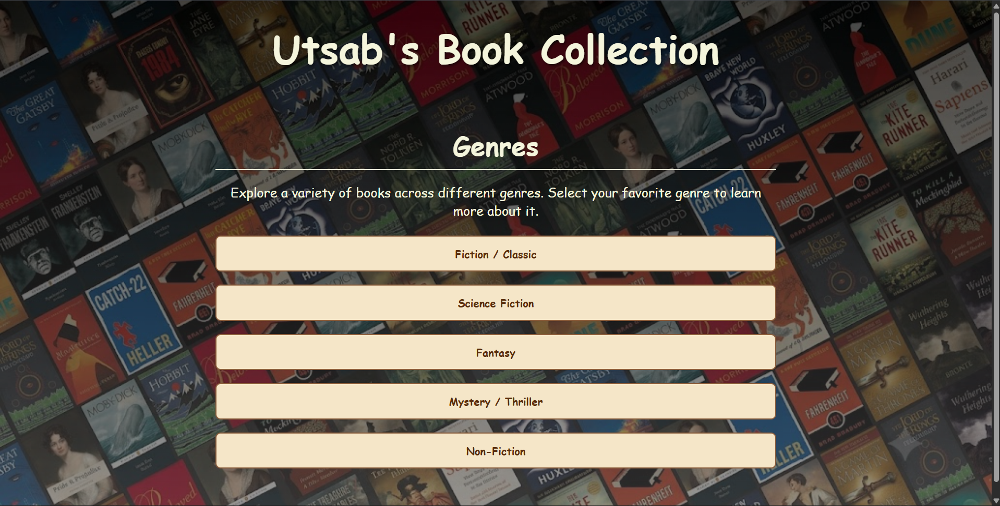
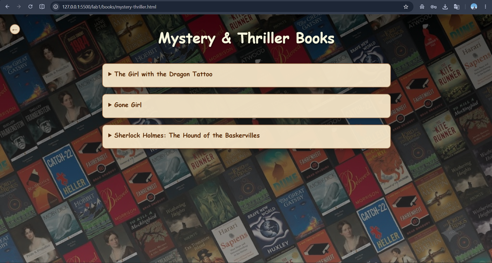
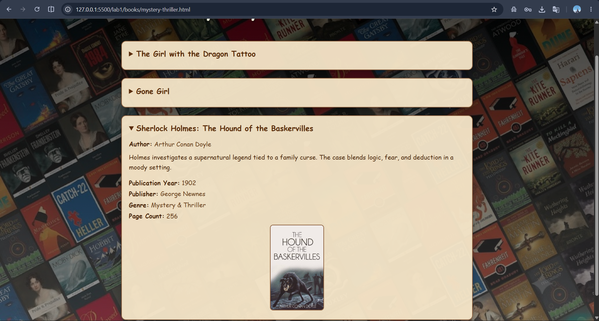
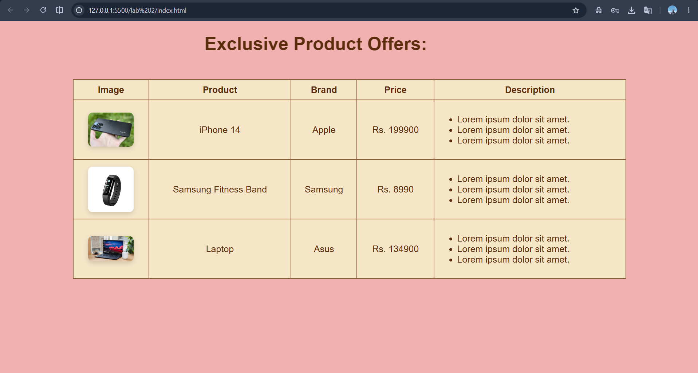
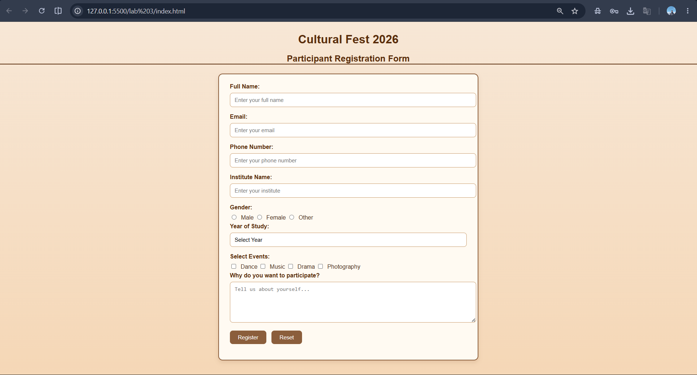

# Web Programming

This repo was created to keep track of all the lab assignments of Web Programming

## Lab-1

Design a website for book information, home page should contain books list, when particular book is clicked, information of the books should display in next page

### Output

-----------------------------------------------------------------

## Lab-2

Design a page to display the product information such as name, brand, pricce and etc with table tag

### Output

-----------------------------------------------------------------

## Lab-3 A
 You are organising a cultural festival. On your website, there is a registration form to register participants from various institutes for different events. Design a registration form on your own and write HTML code for the same. The form must include Text boxes, option buttons, check boxes, a drop-down list, a text area, and submit and reset buttons. Make a creative form

### Output

